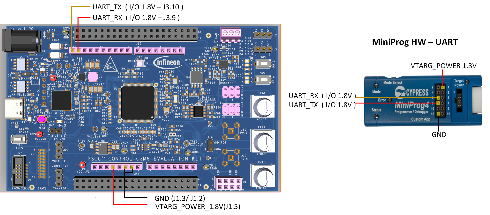
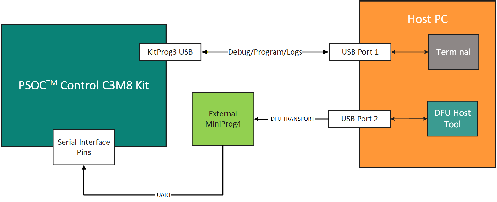
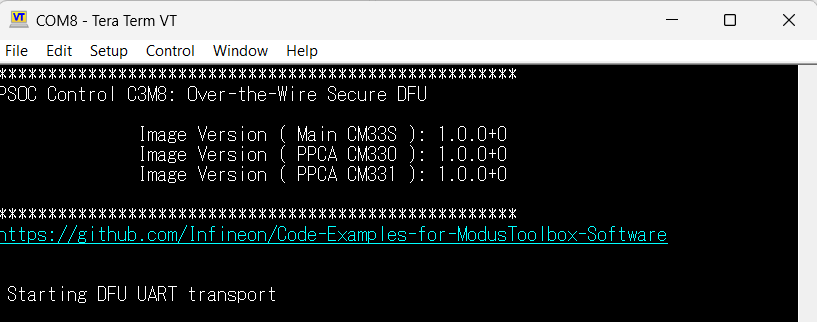
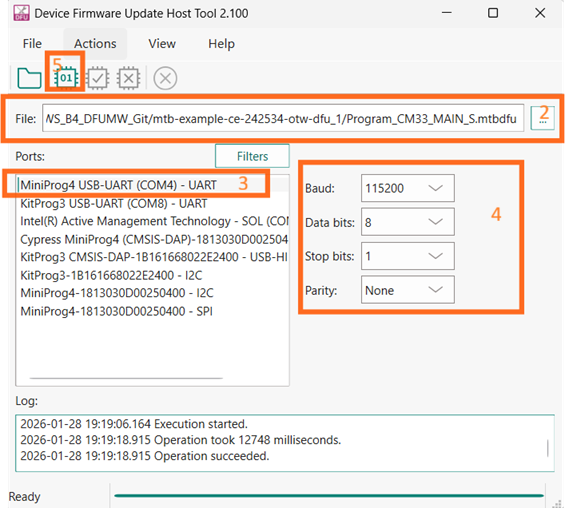
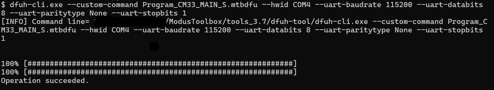
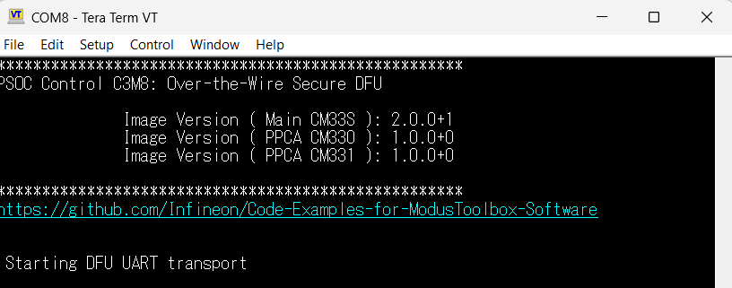
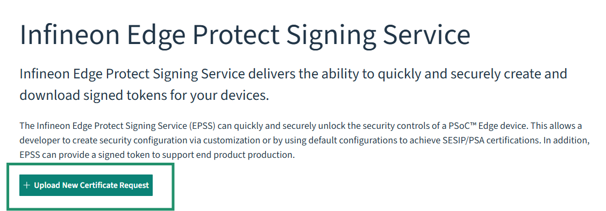
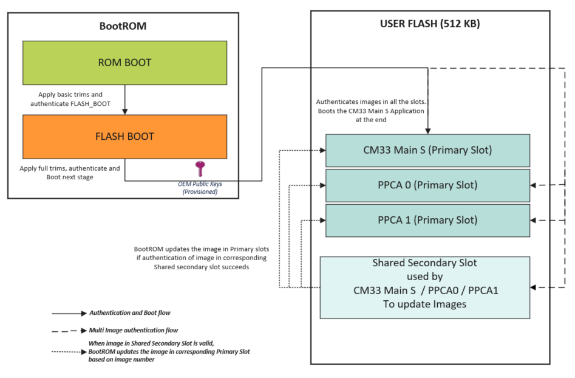
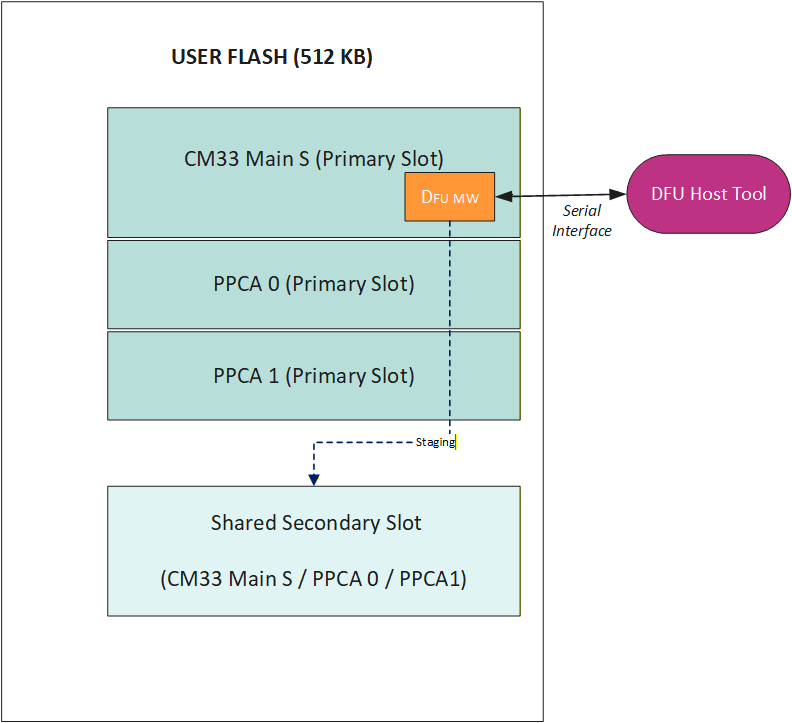

# PSOC&trade; Control C3M/P8 MCU: Over-the-wire secure DFU

This code example demonstrates over-the-wire secure device firmware update (DFU) on the PSoC&trade; Control C3M8 MCU using Infineon’s DFU middleware and the device’s Shared Secondary Slot (SSS). The README guides you through enabling secure boot and SSS, generating and signing an update image, and delivering it over a serial interface for staging in SSS. After successful staging, the device resets; BootROM validates the signed image in SSS and updates the corresponding primary slot. This example follows a three-project structure, because the SSS is shared, only one image can be staged and updated at a time.

See the [Design and implementation](#design-and-implementation) section for the functional description of this example.

[View this README on GitHub.](https://github.com/Infineon/mtb-example-ce242534-otw-dfu)

[Provide feedback on this code example.](https://yourvoice.infineon.com/jfe/form/SV_1NTns53sK2yiljn?Q_EED=eyJVbmlxdWUgRG9jIElkIjoiQ0UyNDI1MzQiLCJTcGVjIE51bWJlciI6IjAwMi00MjUzNCIsIkRvYyBUaXRsZSI6IlBTT0MmdHJhZGU7IENvbnRyb2wgQzNNL1A4IE1DVTogT3Zlci10aGUtd2lyZSBzZWN1cmUgREZVIiwicmlkIjoiYXJha2VyZS5leHRlcm5hbEBpbmZpbmVvbi5jb20iLCJEb2MgdmVyc2lvbiI6IjEuMC4wIiwiRG9jIExhbmd1YWdlIjoiRW5nbGlzaCIsIkRvYyBEaXZpc2lvbiI6Ik1DRCIsIkRvYyBCVSI6IklDVyIsIkRvYyBGYW1pbHkiOiJQU09DIn0=)

## Requirements

- [ModusToolbox&trade;](https://www.infineon.com/modustoolbox) v3.9.0 or later (tested with v3.9.0)
- Board support package (BSP) minimum required version for:
   - KIT_PSC3M8_EVK: v2.2.0
- Programming language: C
- Associated parts: All [PSOC&trade; Control C3M/P8 MCU](https://www.infineon.com/products/microcontroller/32-bit-psoc-arm-cortex/32-bit-psoc-control-arm-cortex-m33-mcu/psoc-control-c3-performance-line) parts


## Supported toolchains (make variable 'TOOLCHAIN')

- GNU Arm&reg; Embedded Compiler v14.2.1 (`GCC_ARM`) – Default value of `TOOLCHAIN`
- IAR C/C++ Compiler v9.70.4 (`IAR`)
- Arm&reg; Compiler v6.22 (`ARM`)


## Supported kits (make variable 'TARGET')

- [PSOC&trade; Control C3M8 Evaluation Kit](https://www.infineon.com/KIT_PSC3M8_EVK) (`KIT_PSC3M8_EVK`) – Default value of `TARGET`


## Hardware setup

This example uses the board's default configuration. See the kit user guide to ensure that the board is configured correctly.

1. This code example uses UART DFU Transport. Make the following connections shown in Figure 1 to use UART DFU Transport with MiniProg4:

    **Figure 1. Sample UART interface connection**

    

2. Connect onboard KitProg3 to the PC

    While both KitProg3 and MiniProg4 (external) must be connected to the PC, do not connect the MiniProg4 USB to the host PC yet – wait until you are instructed to do so later in this README

    **Figure 2** shows the sample hardware connection required for the example:

    **Figure 2. Sample hardware connection for UART**

    


## Software setup

See the [ModusToolbox&trade; tools package installation guide](https://www.infineon.com/ModusToolboxInstallguide) for information about installing and configuring the tools package.

<details><summary><b>ModusToolbox&trade; Edge Protect Security Suite</b></summary>

1. Download and install the [Infineon Developer Center Launcher](https://www.infineon.com/cms/en/design-support/tools/utilities/infineon-developer-center-idc-launcher)

2. Login using your Infineon credentials

3. Download and install the “ModusToolbox&trade; Edge Protect Security Suite” from Developer Center Launcher

    > **Note:** The default installation directory of the Edge Protect Security Suite in Windows operating system is *C:/Users/`<USER>`/Infineon/Tools*

4. After installing the Edge Protect Security Suite, add the Edge Protect tools executable to the system PATH variable

   Edge Protect tools executable is located in *<Edge-Protect-Security-Suite-install-path>/ModusToolbox-Edge-Protect-Security-Suite-`<version>`/tools/edgeprotecttools/bin*

</details>

Install a terminal emulator if you do not have one. Instructions in this document use [Tera Term](https://teratermproject.github.io/index-en.html).

Install Python if not installed already – download from [Python.org](https://www.python.org/downloads/).

This example requires no additional software or tools.

## Using the code example

### Create the project

The ModusToolbox&trade; tools package provides the Project Creator as both a GUI tool and a command line tool.

<details><summary><b>Use Project Creator GUI</b></summary>

1. Open the Project Creator GUI tool

   There are several ways to do this, including launching it from the dashboard or from inside the Eclipse IDE. For more details, see the [Project Creator user guide](https://www.infineon.com/ModusToolboxProjectCreator) (locally available at *{ModusToolbox&trade; install directory}/tools_{version}/project-creator/docs/project-creator.pdf*)

2. On the **Choose Board Support Package (BSP)** page, select a kit supported by this code example. See [Supported kits](#supported-kits-make-variable-target)

   > **Note:** To use this code example for a kit not listed here, you may need to update the source files. If the kit does not have the required resources, the application may not work

3. On the **Select Application** page:

   a. Select the **Application(s) Root Path** and the **Target IDE**

      > **Note:** Depending on how you open the Project Creator tool, these fields may be pre-selected for you

   b. Select this code example from the list by enabling its check box

      > **Note:** You can narrow the list of displayed examples by typing in the filter box

   c. (Optional) Change the suggested **New Application Name** and **New BSP Name**

   d. Click **Create** to complete the application creation process

</details>

<details><summary><b>Use Project Creator CLI</b></summary>

The 'project-creator-cli' tool can be used to create applications from a CLI terminal or from within batch files or shell scripts. This tool is available in the *{ModusToolbox&trade; install directory}/tools_{version}/project-creator/* directory.

Use a CLI terminal to invoke the 'project-creator-cli' tool. On Windows, use the command-line 'modus-shell' program provided in the ModusToolbox&trade; installation instead of a standard Windows command-line application. This shell provides access to all ModusToolbox&trade; tools. You can access it by typing "modus-shell" in the search box in the Windows menu. In Linux and macOS, you can use any terminal application.

The following command clones the "[OTW DFU Application](https://github.com/Infineon/mtb-example-ce242534-otw-dfu)" with the desired name "OtwDfuApp" configured for the *KIT_PSC3M8_EVK* BSP into the specified working directory, *C:/mtb_projects*:


    project-creator-cli --board-id KIT_PSC3M8_EVK --app-id mtb-example-ce242534-otw-dfu --user-app-name OtwDfuApp --target-dir "C:/mtb_projects"


The 'project-creator-cli' tool has the following arguments:

Argument | Description | Required/optional
---------|-------------|-----------
`--board-id` | Defined in the <id> field of the [BSP](https://github.com/Infineon?q=bsp-manifest&type=&language=&sort=) manifest | Required
`--app-id`   | Defined in the <id> field of the [CE](https://github.com/Infineon?q=ce-manifest&type=&language=&sort=) manifest | Required
`--target-dir`| Specify the directory in which the application is to be created if you prefer not to use the default current working directory | Optional
`--user-app-name`| Specify the name of the application if you prefer to have a name other than the example's default name | Optional

<br>

> **Note:** The project-creator-cli tool uses the `git clone` and `make getlibs` commands to fetch the repository and import the required libraries. For details, see the "Project creator tools" section of the [ModusToolbox&trade; tools package user guide](https://www.infineon.com/ModusToolboxUserGuide) (locally available at {ModusToolbox&trade; install directory}/docs_{version}/mtb_user_guide.pdf).

</details>


### Open the project

After the project has been created, you can open it in your preferred development environment.


<details><summary><b>Eclipse IDE</b></summary>

If you opened the Project Creator tool from the included Eclipse IDE, the project will open in Eclipse automatically.

For more details, see the [Eclipse IDE for ModusToolbox&trade; user guide](https://www.infineon.com/MTBEclipseIDEUserGuide) (locally available at *{ModusToolbox&trade; install directory}/docs_{version}/mt_ide_user_guide.pdf*).

</details>


<details><summary><b>Visual Studio (VS) Code</b></summary>

Launch VS Code manually, and then open the generated *{project-name}.code-workspace* file located in the project directory.

For more details, see the [Visual Studio Code for ModusToolbox&trade; user guide](https://www.infineon.com/MTBVSCodeUserGuide) (locally available at *{ModusToolbox&trade; install directory}/docs_{version}/mt_vscode_user_guide.pdf*).

</details>


<details><summary><b>Arm&reg; Keil&reg; µVision&reg;</b></summary>

Double-click the generated *{project-name}.cprj* file to launch the Keil&reg; µVision&reg; IDE.

For more details, see the [Arm&reg; Keil&reg; µVision&reg; for ModusToolbox&trade; user guide](https://www.infineon.com/MTBuVisionUserGuide) (locally available at *{ModusToolbox&trade; install directory}/docs_{version}/mt_uvision_user_guide.pdf*).

</details>


<details><summary><b>IAR Embedded Workbench</b></summary>

Open IAR Embedded Workbench manually, and create a new project. Then select the generated *{project-name}.ipcf* file located in the project directory.

For more details, see the [IAR Embedded Workbench for ModusToolbox&trade; user guide](https://www.infineon.com/MTBIARUserGuide) (locally available at *{ModusToolbox&trade; install directory}/docs_{version}/mt_iar_user_guide.pdf*).

</details>


<details><summary><b>Command line</b></summary>

If you prefer to use the CLI, open the appropriate terminal, and navigate to the project directory. On Windows, use the command-line 'modus-shell' program; on Linux and macOS, you can use any terminal application. From there, you can run various `make` commands.

For more details, see the [ModusToolbox&trade; tools package user guide](https://www.infineon.com/ModusToolboxUserGuide) (locally available at *{ModusToolbox&trade; install directory}/docs_{version}/mtb_user_guide.pdf*).

</details>


## Operation

1. Connect the board to your PC using the provided USB cable through the KitProg3 USB connector

2. Open a terminal program and select the KitProg3 COM port. Set the serial port parameters to 8N1 and 115200 baud

3. Provision the device to enable secure boot and Shared Secondary Slot, which are required to perform DFU, by following the steps in [Steps to enable secure boot and SSS](#steps-to-enable-secure-boot-and-SSS)

4. Set the signing key to sign the boot images

    1. Open *`<app-directory>`/common.mk*

    2. Set **IMAGE_SIGNING_KEY** variable to the path (relative or absolute) of your private key file (oem_dev_priv_key.pem) and save the file

       ```
       IMAGE_SIGNING_KEY = ../keys/oem_dev_priv_key.pem
       ```

5. Build and Program the board using one of the following:

   <details><summary><b>Using Eclipse IDE</b></summary>

      1. Select the application project in the Project Explorer

      2. In the **Quick Panel**, scroll down, and click **\<Application Name> Program (KitProg3_MiniProg4)**
   </details>


   <details><summary><b>In other IDEs</b></summary>

   Follow the instructions in your preferred IDE
   </details>


   <details><summary><b>Using CLI</b></summary>

     From the terminal, execute the `make program` command to build and program the application using the default toolchain to the default target. The default toolchain is specified in the application's Makefile but you can override this value manually:
      ```
      make program TOOLCHAIN=<toolchain>
      ```

      Example:
      ```
      make program TOOLCHAIN=GCC_ARM
      ```
   </details>

6. After programming, the application starts automatically after it is validated by the BootROM. Confirm that "PSOC Control C3M8: Over-the-Wire Secure DFU" is displayed on the UART terminal, along with the version "Image Version : 1.0.0+0" for all 3 images. Confirm that PPCA cores are started by checking whether user LED2 (by PPCA0) and user LED6 (by PPCA1) are blinking at approximately 1000 ms. Confirm that MainCore is blinking User LED1 at approximately 1000 ms

    **Figure 3. Terminal output on program startup**

    

7. Build an update image to be transferred to the device to perform Over-the-wire secure firmware update

    1. Open the file *`<app-directory>`/common.mk* and change `IMG_TYPE` to `UPDATE`. This change is required to relocate the application images to the shared secondary slot
        > **Note:** This will automatically change the image version details as shown below for the updated image
        ```
        IMG_VER_MAJOR=2
        IMG_VER_MINOR=0
        IMG_REVISION=0
        IMG_BUILD_NO=1
        ```

    3. Clean-build the project to generate the update images in the *build/* folder. This will produce three update files

          main_cm33_s_SSS.hex

          ppca_cm33_0_SSS.hex

          ppca_cm33_1_SSS.hex

        > **Note:** Do not program these images using KitProg3

8. Download an update image to the device and launch the BootROM to perform the firmware update

    1. The *mtbdfu* file with the appropriate command sequence to transfer the update image is provided in *`<app-directory>`/Program_CM33_X.mtbdfu*. Open the file and update the `dataFile` field in the `commands` section with the absolute path of the corresponding project HEX file in the *`<app-directory>`/build* folder.

       **Table 1. MTBDFU to SSS file mapping**

        mtbdfu file               | SSS hex file
        :------------------------ | :-----------
        Program_CM33_MAIN_S.mtbdfu| main_cm33_s_SSS.hex
        Program_CM33_PPCA0.mtbdfu | ppca_cm33_0_SSS.hex
        Program_CM33_PPCA1.mtbdfu | ppca_cm33_1_SSS.hex

    2. Ensure that the instructions in the [**Hardware Setup**](#hardware-setup) section have been followed to make the required connections between MiniProg4 and the device. Then, connect MiniProg4 to the PC.

    3. Download the firmware using either the DFU Host Tool GUI or CLI

        <details><summary><b>Using DFU Host Tool GUI</b></summary>

        1. Open *dfuh-tool.exe* located at *\<install-path>/ModusToolbox/tools_x.y/dfuh-tool*
        2. Select *`<app-directory>`/Program_CM33_X.mtbdfu* as the input file to DFU Host Tool
        3. Select the UART interface
        4. Configure the UART interface shown in **Figure 4**
        5. Click on *Execute* button to start the image download

          **Figure 4. DFU Host Tool GUI**

          

        </details><details><summary><b>Using DFU Host Tool CLI</b></summary>

        1. Open the modus-shell terminal and move to DFU Host Tool directory (*[install-path]/ModusToolbox/tools_x.y/dfuh-tool*)

        2. Execute the following DFU CLI command from the Host Tool directory in the shell terminal:

        ```
        dfuh-cli.exe --custom-command path-to-mtbdfu-file --hwid Probe-id/COM Port  --interface-params
        ```

        For example, to use UART interface, use:

        ```
        dfuh-cli.exe --custom-command <path-to/Program_CM33_X.mtbdfu> --hwid COM<PORT NO.> --uart-baudrate 115200 --uart-databits 8 --uart-paritytype None --uart-stopbits 1
        ```

        **Figure 5. Console output of DFU Host Tool CLI**

        

        </details>


          > **Note:** See [DFU Host Tool for ModusToolbox&trade; User Guide](https://www.infineon.com/ModusToolboxDFUHostTool) for more details on each of the interfaces

9. After the firmware update is complete, confirm that the main CM33 core is running the updated image. Verify that "PSOC Control C3M8: Over-the-Wire Secure DFU" is displayed on the UART terminal along with the updated MainCore version, "Image Version : 2.0.0+1". Also, confirm that the MainCore is blinking user LED1 at approximately 500 ms and has started the DFU transport to receive another update image

    **Figure 6. Terminal output of image update for Main CM33 S Core**
    

10. To update a PPCA core image, repeat **Step 8** using the corresponding `Program_CM33_X.mtbdfu` file in DFU Host Tool. Confirm that the selected PPCA image is updated and running by verifying that its version number is updated and that the corresponding user LED1, LED2 for PPCA0 or LED6 for PPCA1, blinks at approximately 500 ms

11. To restore the device to its default configuration for executing other code examples with secureboot disabled, follow the steps mentioned in [Steps to restore the device (Disable secure boot and SSS)](#steps-to-restore-the-device-disable-secure-boot-and-sss)


### Steps to enable secure boot and SSS

**Prerequisite**

Infineon’s Edge Protect Tools is a set of command line tools used to perform the functions needed for key signing, key generation, OEM certificate creation, device provisioning, and so on. These tools are executed through a shell tool. **Edge Protect Tools** executable is made available in C:/Users/<user>/Infineon/Tools/ModusToolbox-Edge-Protect-Security-Suite-x.y.z/tools/edgeprotecttools/bin/ directory.

Add the executable path to the system environment path variable of the host PC.

To use Edge Protect Tools CLI, is recommended to use "modus-shell", which is installed along with ModusToolbox&trade; located in the *ModusToolbox/tools_x.y* directory.


**Transfer of ownership**

Ownership of the device should be transferred to yourself before changing the policy file. Follow the steps to transfer ownership:

1. Open modus-shell and navigate to the application directory

    ```
    cd <app-directory>
    ```

2. Execute the following command to initialize the tools. This is required once after the new version of EAP is installed

    ```
    edgeprotecttools -t psoc_c3x8 init
    ```

3. Execute the following command to configure the openOCD tools path:

    ```
    edgeprotecttools set-ocd --name openocd --path <openocd_path>
    ```

    > **Note:** Replace <openocd_path> with the path to the openocd directory. Typically, this will be *C:/infineon/Tools/ModusToolboxProgtools-x.y/openocd*


4. Create a private and public key pair. The following command generates one pair of keys that is placed in the keys directory:

    ```
    edgeprotecttools --no-interactive-mode create-key --key-type ECDSA-P521 -o keys/oem_dev_priv_key.pem keys/oem_dev_pub_key.pem
    ```

5. To generate a new CSR, execute this command:

    ```
    edgeprotecttools -t psoc_c3x8 oem-csr --public-key-0 keys/oem_dev_pub_key.pem --public-key-1 keys/oem_dev_pub_key.pem --sign-key-0 keys/oem_dev_priv_key.pem --sign-key-1 keys/oem_dev_priv_key.pem --oem "Company Name" --project "Project Name" --project-number 12345678 --cert-type development --output keys/oem_csr_development.bin
    ```

6. Once the CSR is created, it must be signed by Infineon to create a valid OEM certificate. Follow these steps outlined to generate an Infineon signed OEM certificate

      1. Prior to creating a certificate, you must sign up for an Infineon online software tools and services (OSTS) account. Any developer may create an OSTS account by registering at [osts.infineon.com](https://osts.infineon.com/epss/home)

      2. Once you have registered, login to your OSTS account and click on **Edge Protect Signing Service**. This will take you to a page where you can upload your Certificate Signing Request (CSR) that you created in the previous step. Click on the **Upload New Certificate Request** button. This will take you to a window where you can upload your CSR, enter a name for the certificate, and enter a description

         **Figure 7. Upload new certificate request**

         

      3. Enter the certificate name without any spaces or special characters. If you enter the name as “oem”, the generated certificate will be named “oem_cert.bin”. Select the silicon revision as **PSOCC3X8**. Next, enter the description for this certificate in the “Description” field. This description will be in the list of certificates that you own, so you can easily identify one cert from another if you have more than one

      4. Click the **Drop file here or click to upload button** to upload the CSR and navigate to the CSR that you created in the previous step instead of dropping the file in this area. In the previous steps, the path was *`<app-directory>`/keys/oem_csr_developement.bin*

         **Figure 8. Uploading CSR**

         

      5. Once the name and description have been entered and the CSR has been uploaded, click the **Submit**. This should take you back to the original page with a list of certificates under **Manage Certificates**. If the list does not show the most recent certificate generated, click on **Refresh List**. You should now see the signed certificate ready for you to download. Click **Download** on the line that contains the certificate you want to download. This will download the signed certificate to the location on your computer where the files are downloaded

         **Figure 9. Manage certificates**

         

         > **Note:** You can revisit this website at any time and download any of the certificates that have been signed in the past. During development, you only need to perform these steps once, but you can generate multiple certificates if needed


7. Place the certificate obtained in the *`<app-directory>`/keys/* folder as *oem_cert_development.bin*. Provision the device with the key and certificate to transfer the ownership

    ```
    edgeprotecttools -t psoc_c3x8 provision-device -p policy/policy_oem_provisioning.json --ifx-oem-cert keys/oem_cert_development.bin --key keys/oem_dev_priv_key.pem
    ```

**Provision to enable secure boot and SSS**

To enable secure boot and SSS for DFU OTW in the PSOC&trade; Control device, update the necessary fields in the OEM policy and provision the device with the updated policy file.

The OEM policy file (*policy_oem_provisioning.json*) is located in the *[application directory]/policy/* directory, which is created when `edgeprotecttools` is initialized.

1. In the OEM policy, set `device_policy` > `boot` > `boot_cfg_id` > `value` to 'SECURE_APP'

    ```
    "boot": {
      "boot_cfg_id": {
        "description": "A behavior for BOOT_APP_LAYOUT (BOOT_SIMPLE_APP applicable to NORMAL_PROVISIONED only)",
        "applicable_conf": "SIMPLE_APP, SECURE_APP, DUAL_BANK_SIMPLE_APP, DUAL_BANK_SECURE_APP, PROT_FW",
        "value": "SECURE_APP"
      },
    ```
2. In the OEM policy, update the `device_policy` > `boot` > `boot_app_layout` field as shown below so that the BootROM has the start address and size information for the primary application slots and the shared secondary slot

    ```
      "boot_app_layout": {
        "description": "The memory layout for the applications defined by BOOT_CFG_ID. 0x32000000 - 0x33FFFFFF for secure addresses; 0x22000000 - 0x23FFFFFF for non-secure addresses",
        "value": [
          {
            "address": "0x32000000",
            "size": "0x20000"
          },
          {
            "address": "0x32020000",
            "size": "0x09000"
          },
          {
            "address": "0x32029000",
            "size": "0x09000"
          },
          {
            "address": "0x00000000",
            "size": "0x00"
          },
          {
            "address": "0x32032000",
            "size": "0x20200"
          }
        ]
      },
    ```

3. Once the policy is updated, provision the device with the updated policy

    ```
    edgeprotecttools -t psoc_c3x8 provision-device -p policy/policy_oem_provisioning.json --ifx-oem-cert keys/oem_cert_development.bin --key keys/oem_dev_priv_key.pem
    ```


### Steps to restore the device (Disable secure boot and SSS)

Revert the changes to policy file and reprovision the device.

1. In the OEM policy, set `device_policy` > `boot` > `boot_cfg_id` > `value` to 'SIMPLE_APP'

    ```
    "boot": {
      "boot_cfg_id": {
        "description": "A behavior for BOOT_APP_LAYOUT (BOOT_SIMPLE_APP applicable to NORMAL_PROVISIONED only)",
        "applicable_conf": "SIMPLE_APP, SECURE_APP, DUAL_BANK_SIMPLE_APP, DUAL_BANK_SECURE_APP, PROT_FW",
        "value": "SIMPLE_APP"
      },
    ```
2. (Optional) In the OEM policy, update the `device_policy` > `boot` > `boot_app_layout` field, as shown below

    ```
      "boot_app_layout": {
        "description": "The memory layout for the applications defined by BOOT_CFG_ID. 0x32000000 - 0x33FFFFFF for secure addresses; 0x22000000 - 0x23FFFFFF for non-secure addresses",
        "value": [
          {
            "address": "0x32000000",
            "size": "0x40000"
          },
          {
            "address": "0x00000000",
            "size": "0x00"
          },
          {
            "address": "0x00000000",
            "size": "0x00"
          },
          {
            "address": "0x00000000",
            "size": "0x00"
          },
          {
            "address": "0x00000000",
            "size": "0x00"
          }
        ]
      },
    ```

3. Once the policy changes are reverted, provision the device

    ```
    edgeprotecttools -t psoc_c3x8 provision-device -p policy/policy_oem_provisioning.json --ifx-oem-cert keys/oem_cert_development.bin --key keys/oem_dev_priv_key.pem
    ```


## Debugging

You can debug the example to step through the code.


<details><summary><b>In Eclipse IDE</b></summary>

Use the **\<Application Name> Debug (KitProg3_MiniProg4)** configuration in the **Quick Panel**. For details, see the "Program and debug" section in the [Eclipse IDE for ModusToolbox&trade; user guide](https://www.infineon.com/MTBEclipseIDEUserGuide).


</details>


<details><summary><b>In other IDEs</b></summary>

Follow the instructions in your preferred IDE.

</details>


## Design and implementation

This code example uses a three-project structure to develop code for the main CM33, PPCA0, and PPCA1 cores. Although TrustZone is enabled in main CM33 core, this example uses only the secure processing environment (SPE). The three project folders are:

**Table 2. Application projects**

Project       | Description
-------       | -----------------------
*main_cm33_s* | Project for main CM33 SPE
*ppca_cm33_0* | Project for PPCA CM330 non-secure processing environment (NSPE)
*ppca_cm33_1* | Project for PPCA CM331 NSPE


<br>

The main CM33 core acts as the secure orchestrator and applies the required device security. It loads the PPCA core images into their respective CODE SRAM regions and enables them as needed. It also hosts the DFU middleware to download and stage the update image in the shared secondary slot, then issues a device reset after a successful download.

After a successful boot, the PPCA cores blink the LEDs.


### Resources and settings

The application uses DEBUG UART to print messages on the UART terminal. The UART resource initialization and retargeting of the standard I/O to the UART port is performed using the [retarget-io](https://github.com/Infineon/retarget-io) library.
The application uses DFU UART to receive the update image and stage it in SSS. The DFU UART port is managed by the [DFU](https://github.com/Infineon/dfu) middleware.

**Table 3. Application resources**

Resource    | Alias/object       |    Purpose
:---------- | :-------------     | :------------
 UART (HAL) | DEBUG_UART_hal_obj | UART HAL object used by Retarget-IO for the Debug UART port
 UART (HAL) | DFU_UART_hal_obj   | UART HAL object used by DFU-MW for the DFU UART port
 GPIO (PDL) | CYBSP_USER_LED2    | User LED2 from PPCA Core 0
 GPIO (PDL) | CYBSP_USER_LED6    | User LED6 from PPCA Core 1
 GPIO (PDL) | CYBSP_USER_LED1    | User LED1 from main core


### Flash layout

PSOC&trade; Control C3M8 MCU provides 512 KB of internal flash.
  - Reserve three primary application image slots. All three use the same shared secondary slot for staging updates
  - Ensure that the combined size of all primary slots and the shared secondary slot fits within 512 KB
  - The shared secondary slot is used to safely stage a new image before it is authenticated and copied to the corresponding primary slot

      **Figure 10. Flash mapping**

      ```text
      0x32000000  +----------------------------------+
                  | Primary slot 0 (main_cm33_s)     |
                  | Size: 0x20000 (128 KB)           |
      0x32020000  +----------------------------------+
                  | Primary slot 1 (ppca_cm33_0)     |
                  | Size: 0x09000 (36 KB)            |
      0x32029000  +----------------------------------+
                  | Primary slot 2 (ppca_cm33_1)     |
                  | Size: 0x09000 (36 KB)            |
      0x32032000  +----------------------------------+
                  | Shared secondary slot (SSS)      |
                  | Size: 0x20200 (128.5 KB)         |
      0x32052200  +----------------------------------+
                  | Unused flash                     |
                  | Size: 0x2DE00 (183.5 KB)         |
      0x32080000  +----------------------------------+
      ```

### Firmware boot and update flow

1. BootROM authenticates the images, including any updated image stored in the shared secondary slot

2. If the shared secondary slot contains a valid update image, BootROM promotes it by copying it to the corresponding primary slot

3. After validation and any required promotion, BootROM boots the `main_cm33_s` application from its primary slot

     **Figure 11. Flow chart**

    

### Update image download/staging

1. The `main_cm33_s` application integrates Infineon’s DFU middleware to receive firmware updates over UART and stage them in the designated shared secondary slot

2. The middleware manages the transfer, including session control, chunking, and integrity checks, and writes the signed image and its associated metadata to flash

3. On the PC, use the DFU Host tool to initiate the transfer and send the signed image over UART to the device’s DFU endpoint

4. After a successful transfer, the image remains in the shared secondary slot until BootROM validates it and promotes it on the next boot

   **Figure 12. Update image download**

   

<br>


## Related resources

Resources  | Links
-----------|----------------------------------
Code examples  | [Using ModusToolbox&trade;](https://github.com/Infineon/Code-Examples-for-ModusToolbox-Software) on GitHub
Device documentation | [PSOC&trade; Control C3M/P8 MCU documents](https://www.infineon.com/products/microcontroller/32-bit-psoc-arm-cortex/32-bit-psoc-control-arm-cortex-m33-mcu/psoc-control-c3-performance-line?ftab=01#Documents)
Development kits | Select your kits from the [Evaluation board finder](https://www.infineon.com/cms/en/design-support/finder-selection-tools/product-finder/evaluation-board)
Libraries on GitHub  | [mtb-dsl-psc3m8](https://github.com/Infineon/mtb-dsl-psc3m8) – Device Support Library (DSL) <br> [retarget-io](https://github.com/Infineon/retarget-io) – Utility library to retarget STDIO messages to a UART port
Tools  | [ModusToolbox&trade;](https://www.infineon.com/modustoolbox) – ModusToolbox&trade; software is a collection of easy-to-use libraries and tools enabling rapid development with Infineon MCUs for applications ranging from wireless and cloud-connected systems, edge AI/ML, embedded sense and control, to wired USB connectivity using PSOC&trade; Industrial/IoT MCUs, AIROC&trade; Wi-Fi and Bluetooth&reg; connectivity devices, XMC&trade; Industrial MCUs, and EZ-USB&trade;/EZ-PD&trade; wired connectivity controllers. ModusToolbox&trade; incorporates a comprehensive set of BSPs, HAL, libraries, configuration tools, and provides support for industry-standard IDEs to fast-track your embedded application development


<br>


## Other resources

Infineon provides a wealth of data at [www.infineon.com](https://www.infineon.com) to help you select the right device, and quickly and effectively integrate it into your design.


## Document history

Document title: *CE242534* - *PSOC&trade; Control C3M/P8 MCU: Over-the-wire secure DFU*

 Version | Description of change
 ------- | ---------------------
 1.0.0   | New code example

<br>


All referenced product or service names and trademarks are the property of their respective owners.

The Bluetooth&reg; word mark and logos are registered trademarks owned by Bluetooth SIG, Inc., and any use of such marks by Infineon is under license.

PSOC&trade;, formerly known as PSoC&trade;, is a trademark of Infineon Technologies. Any references to PSoC&trade; in this document or others shall be deemed to refer to PSOC&trade;.

---------------------------------------------------------

(c) 2026, Infineon Technologies AG, or an affiliate of Infineon Technologies AG. All rights reserved.
This software, associated documentation and materials ("Software") is owned by Infineon Technologies AG or one of its affiliates ("Infineon") and is protected by and subject to worldwide patent protection, worldwide copyright laws, and international treaty provisions. Therefore, you may use this Software only as provided in the license agreement accompanying the software package from which you obtained this Software. If no license agreement applies, then any use, reproduction, modification, translation, or compilation of this Software is prohibited without the express written permission of Infineon.
<br>
Disclaimer: UNLESS OTHERWISE EXPRESSLY AGREED WITH INFINEON, THIS SOFTWARE IS PROVIDED AS-IS, WITH NO WARRANTY OF ANY KIND, EXPRESS OR IMPLIED, INCLUDING, BUT NOT LIMITED TO, ALL WARRANTIES OF NON-INFRINGEMENT OF THIRD-PARTY RIGHTS AND IMPLIED WARRANTIES SUCH AS WARRANTIES OF FITNESS FOR A SPECIFIC USE/PURPOSE OR MERCHANTABILITY. Infineon reserves the right to make changes to the Software without notice. You are responsible for properly designing, programming, and testing the functionality and safety of your intended application of the Software, as well as complying with any legal requirements related to its use. Infineon does not guarantee that the Software will be free from intrusion, data theft or loss, or other breaches (“Security Breaches”), and Infineon shall have no liability arising out of any Security Breaches. Unless otherwise explicitly approved by Infineon, the Software may not be used in any application where a failure of the Product or any consequences of the use thereof can reasonably be expected to result in personal injury.
